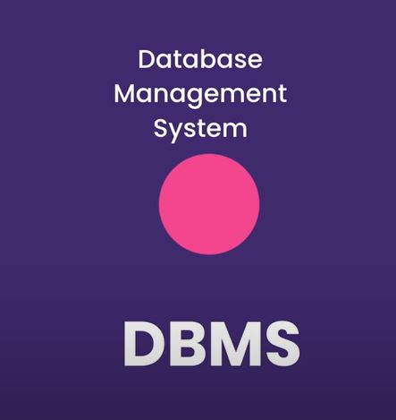
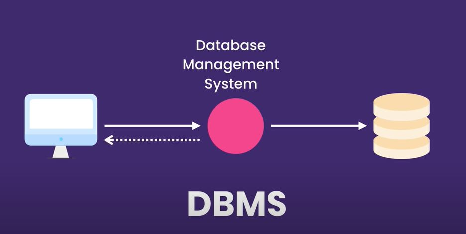
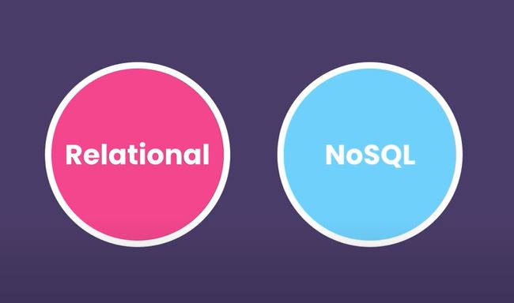
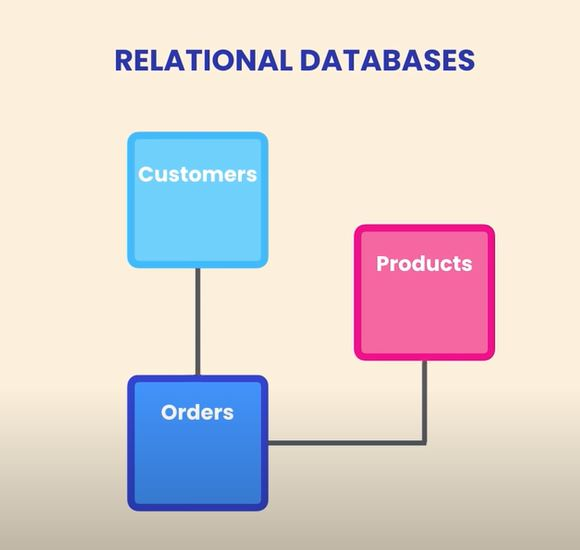
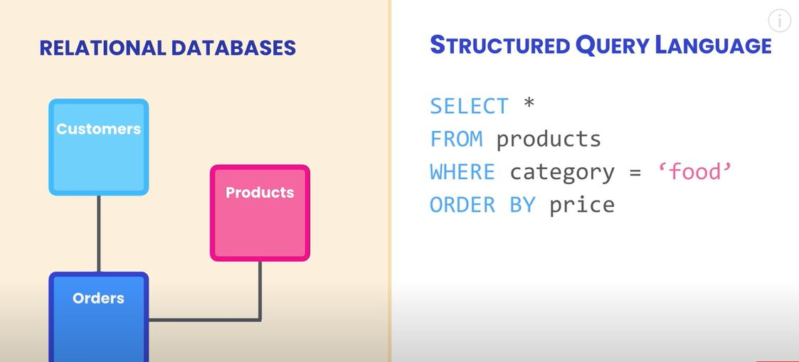
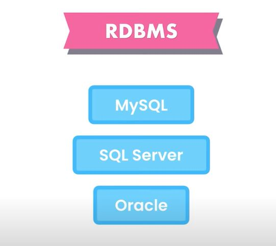

# mysql_tutorial
## If you're looking for a complete SQL tutorial for beginners with examples, this tutorial is a great way to learn SQL basics. Just follow through and you'll be able to write SQL queries in no time. 

#
## SQL, short for Structured Query Language, is a language used by software developers, data scientists and anyone who works with data. With SQL, you can store data in relational databases and write queries to extract valuable information. 

# What is Database??

## Database is a colection of data storded in a format that can be easily accessed. 

Database manage করার জন্য আমরা যে software ব্যবহার করি সেটা হলো Database Mangement System. 

আমরা DBMS এর সাথে connect করে একে instruction দেই data modify করার জন্য। 

DBMS আমাদের instruction exicute করে result দেয়। 

#
বিভিন্ন রকম Database Management system আছে। এদেরকে ২ ভাবে ভাগ করা যেতে পারে। 

* Relational
* NoSQL

### Relational Database এ data, table এ থাকে যারা নিজেদের মধ্যে connected থাকে using relationship.

### প্রতিটা table এ একটি নির্দিষ্ট type of object এর data থাকে। যেমন আমরা নিচের ছবিতে দেখতে পাচ্ছি । product , customer, order এর জন্য আলাদা table.

## SQL , SQUEL is the language that we use to work with these type of relational database. 

## বিভিন্ন রকম Relation Database Management system আছে। 

#
## এই tutorial এ আমরা mysql database সম্পর্কে জানবো যেটা অনেক popular ও opensource database. 

# 

# Installing MySQL : 

[Click here to download MySQL on windows](https://dev.mysql.com/downloads/installer/)
